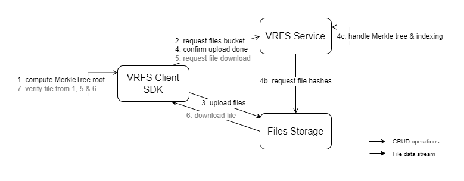
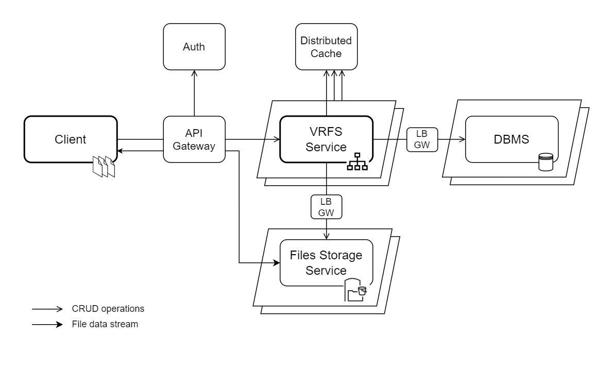
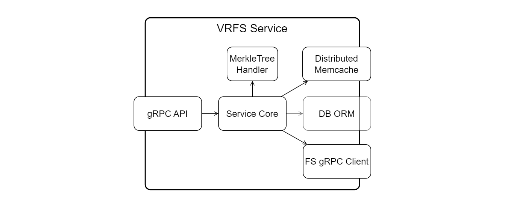

# Verifiable Remote Files Storage

## Purpose

### General

The Verifiable Remote File Storage service aims at checking the consistency of uploaded then downloaded files, based on file hashes and their MerkleTree proofs.

This is the mono repository for the Go-based implementation of 2 backend services and 1 CLI client.

The gRPC protocol is used for optimal client-server and server-to-server communications.


### Protocol Overview

The overall implemented protocol for uploading or downloading local files to the remote file storage service, and have the files verified based on the generation of a Merkle Tree root and proofs for checking the leaf values (the file hashes here):



Key principles:
* The VRFS Service handles the creds/access to the [external] FS service
* Files are directly uploaded to & downloaded from the FS service
* VRFS retrieves the file hashes from the FS server, for building its Merkle Tree and store corresponding proofs

Design motivations:
* Separation of concerns: storing the filesets (File Storage server) Vs. handling the files' verification process (VRFS API)
    * Independence towards the used files storage service, i.e. can be replaced by a 3rd party file storage solution
    * Corresponding micro-services cloud hosting platform instances can be customized per their core business requirements
* Minimized data bandwidth consumption: with this design option
    * the fact that the file storage service exposes an API for retrieving the file bucket hashes is a key requirement since this avoids the need for the VRFS API to upload or download the files
    * Integrating a 3rd party solution would probably not support the provision of the  file hashes. Integrating with a IPFS CID might be an option.

This protocol results in: 
* 6 steps to remotely store the files - 1 client command: 1 VRFS API & n file uploads requests + 1 VRFS->FS API request
* 3 steps to retrieve & verify a file - 1 client command: 1 VRFS API & 1 file download requests

3 main components have been implemented:
1. The VRFS API Service - The core component of this protocol, exposing a gRPC API
2. A basic File Storage service exposing a gRPC API to batch upload files and download them individually. It also supports the retrieval of the stored files' hashes
3. A CLI client to execute the 2 main upload and download operations, along with MerkleProof-based file hash verifications


## Instructions

### Running the Servers

#### Docker Compose

A Docker Compose setup enables building & running the 2 server modules and a Redis DB acting as a distributed KV cache:

```shell
# Standard Docker Compose launch
$ docker compose up

# OR using a few custom config options
$ make docker-compose-up

# Quick clean-up (removal) of the local Docker containers & images for this project
$ make docker-cleanup
```

The Docker images have their build time optimized through caching, and a production layer 
enables running clean instances.

Refer to the respective Dockerfiles:
* VRFS API server: [`./server`](./server/Dockerfile)
* File Storage server: [`./fileserver`](./fileserver/Dockerfile)

Notice there the monorepo specific dependencies management/requirements in case of `replace` in the respective `go.mod` files.

[Distroless images](https://github.com/GoogleContainerTools/distroless) are used for generating light Docker containers:


#### Manual Run of local Services

```shell
# Run locally the File Storage server
$ go run ./fileserver

# Run locally the VRFS server
$ go run ./server
```

### Running the Client CLI

List the available client CLI parameters:

```shell
$ go run ./client -h
```

File Upload & Verify protocol: Upload all files of a local directory to the remote file storage server:

```shell
# Upload a fileset with default service endpoints
$ go run ./client -action upload -updir ./fs-playground/forupload/catyclops

# Or by specifying the service endpoints and a max chunk size
$ go run ./client -action upload -updir ./fs-playground/forupload/catyclops \
    -api vrfs-api:50051 \
    -fs vrfs-fs:9000 \
    -chunk 1024
```

Download locally a file from VFRS API & the File Storage services and have it verified:

```shell
# Download & verify file command, by specifying an alternative download directory
$ go run ./client -action download \
    -fileset fs-10B..7E21 \
    -index 5
    -downdir ./fs-playground/downloaded
```

Demo scripts for running client commands are available in the [Makefile](./Makefile). 
A default playground directory [fs-playground](./fs-playground/) with sample files is provided, for testing files' uploads and downloads.

```shell
# Store local files remotely
$ make demo-run-upload
# Download a file
$ make demo-run-download
```


### Building Executable Go Modules

```shell
# Build exec Client CLI
go build ./client -o ./dist/vrfs-client
# Build exec VRFS Server
go build ./server -o ./dist/vrfs-server
# Build exec VRFS FileServer
go build ./fileserver -o ./dist/vrfs-fs
```

### Modules Runtime Config

The CLI client is configurable via the command parameters it exposes. Its settings and default values are defined in the client [`main.go`](./client/main.go).

The VRFS & FS server configurations rely on their dedicated `yaml` config file available in [config](./config), those parameters can be overridden via optional `.env` files or via runtime environment variables. 
Refer to the [cleanenv](https://github.com/ilyakaznacheev/cleanenv) solution and its integration made in the utility [`libs/config`](./libs/config.go).

All config settings come with default values to enable an out-of-the-box experience, and an easier dev one!


## Development Framework

### Tools

Pre-requisites:
* [Go](https://golang.org/) dev framework >= v1.18 - [install](https://go.dev/doc/install)
* [Protocol buffer](https://developers.google.com/protocol-buffers) compiler >= v3 - [install](https://grpc.io/docs/protoc-installation/) 
* Protobuf gRPC Go plugins to generate the client SDK and server API stubs - [install](https://grpc.io/docs/languages/go/quickstart/#prerequisites)
* [Docker](https://www.docker.com/) for running the backend services in virtual containers - [install](https://docs.docker.com/engine/install/)
* `make` for benefiting from the available [`Makefile`](./Makefile) commands

Versions used while developing:
* Go : `go1.21.4 linux/amd64`
* protoc : `libprotoc 3.12.4`
* Docker : `24.0.7, build afdd53b`

### Go Workspace

A Go workspace is used for handling the different modules part of this monorepo.

Refer to the workspace config file: [`go.work`](./go.work).

Adding a new module to the workspace:

```shell
$ mkdir moduleX
moduleX/$ go mod init github.com/ja88a/vrfs-go-merkletree/moduleX
$ go work use ./moduleX
```


## Architecture

Overview of the considered overall, scalable solution to be implemented: 



Overview of the VRFS Service main components:




## Development status

The depicted files' verification protocol is implemented finalized.

Efficient serialization of the MerkleTree Proofs might be further improved when they are persisted in the DB, on fileset upload verification/confirmation, then retrieved and communicated to clients on every file download info requests for later verification.

A persistence layer for the VRFS Service is implemented via a distributed memory cache solution, using [Redis](https://redis.com/glossary/distributed-caching/). 

An additional DB ORM integration could be required, a NoSQL DB such as Mongo could do the job.

The computation models and their settings for the backbone Merkle Tree reference is to be 
further refined and benchmarked, per the integration use case(s) and corresponding optimization 
requirements for ad-hoc computation, storage and transport.

For the file hashes computation, constituing the MarkleTree leaf values, the SHA2-256 hashing function is used (NIS, 64 characters long for every string).
Alternative file hashing functions might be considered to adapt and/or optimize the computations runtime.
Notice the fact that the client and the FS server require using the same hashing function on files since both build a Merkle Tree out of the file hashes.


## Solution Readiness - Status

### Missing for Production

#### Access & Traffic management

No user authentication mechanism has been implemented to protect the access to the service APIs.

Available client authentication options:
* API Keys support
* ECDSA signature - a digital signature made from an externally owned account

External services acting as load balancers and an API Gateway should be integrated in order to deal with:
* Load balancing, API requests routing & APIs versioning - Ex.: AWS ALB
* External communications encryption support & private subnets management 
* User authentication & permissions - Ex.: AWS Cognito, KeyCloack

#### Logs Reporting

Actual services' JSON logs should be reported to a remote log watcher to review them, monitor the service and/or automate runtime alerts triggering.

Example of available 3rd party solutions: 
* AWS CloudWatch - Refer to their [Go SDK](https://docs.aws.amazon.com/sdk-for-go/api/service/cloudwatch/)
* Sentry.io - Refer to [sentry-go](https://github.com/getsentry/sentry-go).

#### Services Monitoring

A monitoring infra is to be added and servers should report their usage & performance statistics.

The integration of a Prometheus-like time serie events database should be considered so that each servers report their stats.

Complementary tools like a monitoring dashboard, e.g. Grafana, and runtime alerts management, e.g. Kibana, would be welcome.

### Required Improvements

#### End-to-end TLS Encryption

Actual gRPC communications should rely on TLS encryption over HTTP.

X.509 certificates are to be deployed at servers' level and secure connections initiated by the client. 

Refer to actual `grpc.WithTransportCredentials`.

#### API Versions Management

A basic versioning mechanism is actually implemented for managing the Protobuf-based gRPC stubs integrated by the client and the servers.

The Docker images are tagged using the semver CLI tool.

The services handle a version number through their configuration file.

Actual integration of the semver solution is to be pushed further.

#### Automated Tests

Automated unit and integration testing have not been addressed yet.

E2E tests & a continuous integration / deployment flows should be implemented.

#### CLI Client

A Cobra-like integration should be considered if the CLI client is given a priority.

A logs manager might also be integrated for prettier outputs.
